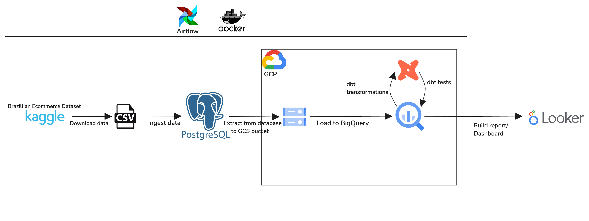

# Brazilian E-Commerce Data Engineering Project

## Overview

This project develops a robust end-to-end ELT (Extract, Load, Transform) pipeline using the Brazilian E-Commerce dataset from Kaggle. The solution employs a suite of modern data engineering tools, including PostgreSQL, Docker, Docker Compose, Apache Airflow, dbt, and BigQuery, to ingest, process, and analyze e-commerce data. The primary objective is to derive actionable insights into product category sales, delivery times, and order distribution across different states in Brazil.

## Data Architecture

Fig: Data Architecture

This project employs a modern data stack to manage and process e-commerce transactional data:

### **Apache Airflow**: **Orchestration**
- **Role**: Manages and orchestrates the entire data pipeline, ensuring the seamless flow of data from the OLTP database (PostgreSQL) to the data warehouse (BigQuery).
- **Python Integration**: Airflow’s integration with Python allows for custom scripting and flexible data handling, making it ideal for dynamic data pipelines.

### **PostgreSQL**: **Transactional Data Storage**
- **Role**: Serves as an OLTP database, representing the transactional system of an e-commerce business. It stores raw transactional data locally before it is moved for further processing.

### **Google Cloud Storage (GCS)**: **Staging Area**
- **Role**: Serves as a staging area where data is temporarily stored after being extracted from PostgreSQL. This intermediate step allows for scalable and reliable data handling before loading into BigQuery.
- **Advantages**: GCS provides durable and scalable storage, ideal for handling large datasets in a cost-effective manner.
- **Note**: This could also serve as a data lake.

### **dbt (Data Build Tool)**: **Data Transformation**
- **Role**: Used to transform raw data into analytics-ready models using SQL, leveraging dbt’s modular approach.
- **Capabilities**: dbt excels in data modeling, testing, and documentation, ensuring high-quality and maintainable data transformations.

### **BigQuery**: **Data Warehousing**
- **Role**: Serves as the destination data warehouse, where transformed data is stored, transformed and made available for downstream consumers.
- **Advantages**: BigQuery’s ability to handle large-scale queries efficiently makes it ideal.

### **Docker & Docker Compose**: **Containerization**
- **Role**: Ensures consistent environments across development and production, simplifying deployment and management of multiple services.


## Prerequisites
- Python 3.12.x
- Docker and Docker Compose.
- Google Cloud Platform account with BigQuery enabled.
- Kaggle account to download the Brazilian E-Commerce dataset.

## Project Structure
```plaintext
├── dags                  : Airflow DAGs for orchestrating data pipelines
├── data                  : Directory to store raw csv data from kaggle
├── dbt_cap               : dbt models for data transformation
├── source_setup          : Setup scripts for initial data load and configuration
├── .gitignore            : Files and directories to be ignored by Git
├── Dockerfile            : Dockerfile to build the custom Airflow image with dbt
├── docker-compose.yml    : Docker Compose configuration to manage services
├── env.example           : Example environment file for setting up variables
├── requirements.txt      : Python package dependencies
```

## How to Run This Project

1. Clone the repository
    ```bash 
    git clone https://github.com/thevictoressien/alt-de-capstone.git
    ```
2. Set up the environment

    - Change directory to project directory
        ```bash 
        cd alt-de-capstone
        ```
    - Create a virtual environment
        ```bash 
        python -m venv <your virtual environment name>
        ```
    - Activate it
        ```bash
        source <your virtual environment name>/bin/activate  
        # On Windows, use `<your virtual environment name>\Scripts\activate`
        ```
    - Install requirements
        ```bash 
        pip install -r requirements.txt
        ```
3. Build and run the docker containers

    - Build airflow with dbt image
        ```bash
        docker-compose build
        ```
    - Run the containers
        ```bash
        docker-compose up
        ```
4. Accessing the Airflow Web UI

    - Once the containers are running, you can access the Airflow web UI by navigating to http:/localhost:8080 in your browser.
5. Running the data pipeline

    - Trigger the DAGs from the Airflow web UI to start the data ingestion, processing, and loading processes.

## Lessons Learned

This project provided valuable experiences across several key areas:

- **Apache Airflow**:
  - **Exploration**: Delved into Airflow's rich set of operators, including those for transferring data between PostgreSQL and Google Cloud Storage (GCS), and between GCS and BigQuery. This hands-on experience was crucial for understanding how to manage and orchestrate complex workflows.
  - **Key Takeaway**: Gained proficiency in designing and executing Directed Acyclic Graphs (DAGs) to automate and streamline data pipelines, enhancing the reliability and efficiency of data movement and processing tasks.

- **dbt (Data Build Tool)**:
  - **Efficient Query Writing**: Leveraged dbt’s modular structure to write and optimize SQL queries for data transformation. This included creating reusable models, managing dependencies, and incorporating best practices for query efficiency.
  - **Key Takeaway**: Appreciated dbt's powerful capabilities in modular data modeling, testing, and documentation, which significantly improved the quality and maintainability of the data transformation layer.

- **Google Cloud Platform (GCP)**:
  - **Permissions and Service Accounts**: Gained hands-on experience with GCP’s permission models and service account management, crucial for setting up secure and scalable cloud environments. Learned how to configure and manage permissions to ensure proper access control and security for the data pipeline.
  - **Key Takeaway**: Developed a deeper understanding of cloud security and resource management, which is essential for maintaining a secure and compliant data infrastructure.

- **Docker**:
  - **Containerization**: Achieved significant milestones in Docker usage by creating a Docker image that integrates both Airflow and dbt. This experience was instrumental in understanding containerization for managing complex data processing environments.
  - **Docker Compose**: Overcame challenges with Docker Compose, leading to a more profound comprehension of orchestrating multi-container applications. This improved understanding was critical for managing dependencies and configurations in a cohesive and efficient manner.
  - **Key Takeaway**: The ability to define and manage containerized environments streamlined development and deployment processes, demonstrating the power of Docker in creating consistent and reproducible setups.

These lessons not only expanded technical expertise but also provided practical experience in building and managing robust data engineering solutions.

## Contact

Feel free to contact me if you have any questions at:
- [LinkedIn](https://www.linkedin.com/in/thevictoressien)
