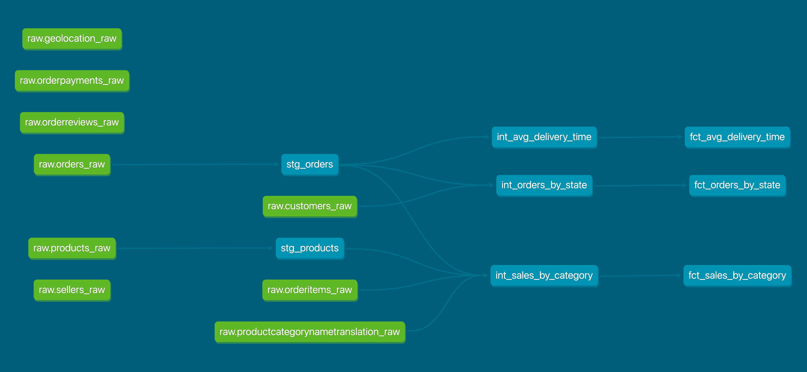

# dbt Models Documentation

## Overview
This dbt project transforms the e-commerce data through a series of models structured in three layers: staging, intermediate, and final. This process aims to provide clean, aggregated data for analysis of sales, orders, and delivery performance.

## Project Structure
The project is organized into three main model layers:
- **Staging**
- **Intermediate**
- **Final**

Each layer serves a specific purpose in the data transformation process.

## Model Layers and Configurations

### 1. Staging Layer
- **Materialization**: View
- **Purpose**: Initial data cleaning and preparation
- **Models**:
  - `stg_orders`: Selects key fields from `orders_raw`
  - `stg_products`: Extracts product information from `products_raw`

### 2. Intermediate Layer
- **Materialization**: Table
- **Purpose**: Complex transformations and aggregations
- **Models**:
  - `int_sales_by_category`: Calculates total sales by product category
  - `int_orders_by_state`: Counts total orders per customer state
  - `int_avg_delivery_time`: Computes delivery time for each order

### 3. Final Layer
- **Materialization**: Table
- **Purpose**: Business-ready analytical models
- **Models**:
  - `fct_avg_delivery_time`: Overall average delivery time
  - `fct_orders_by_state`: Ranks states by total orders
  - `fct_sales_by_category`: Ranks product categories by total sales

## Detailed Model Descriptions

### Staging Models
- **`stg_orders`**
  - **Sources from**: `orders_raw`
  - **Selects**: `order_id`, `customer_id`, `order_status`, `order_purchase_timestamp`, `order_delivered_customer_date`
  - **Purpose**: Prepares clean order data for further processing

- **`stg_products`**
  - **Sources from**: `products_raw`
  - **Selects**: `product_id`, `product_category_name`
  - **Purpose**: Provides a clean view of product information

### Intermediate Models
- **`int_sales_by_category`**
  - **Joins**: `stg_orders`, `orderitems_raw`, `stg_products`, `productcategorynametranslation_raw`
  - **Calculates**: Total sales per product category
  - **Filters**: Delivered orders only

- **`int_orders_by_state`**
  - **Joins**: `stg_orders`, `customers_raw`
  - **Calculates**: Total orders per customer state
  - **Filters**: Delivered orders only

- **`int_avg_delivery_time`**
  - **Sources from**: `stg_orders`
  - **Calculates**: 
      - Delivery time in days for each order
      - Average delivery time across all orders
  - **Filters**: Delivered orders only

### Final Models
- **`fct_avg_delivery_time`**
  - **Sources from**: `int_avg_delivery_time`
  - **Calculates**: 
      - Overall average delivery time across all orders
      - Number of orders above and below average delivery time
      - Percentage of orders above and below average delivery time
  

- **`fct_orders_by_state`**
  - **Sources from**: `int_orders_by_state`
  - **Adds**: Rank column using `RANK()` window function
  - **Purpose**: Ranks states by total order volume

- **`fct_sales_by_category`**
  - **Sources from**: `int_sales_by_category`
  - **Adds**: Rank column using `RANK()` window function
  - **Purpose**: Ranks product categories by total sales

## Best Practices and Reasoning
- **Modularity**: The three-layer approach allows for clear separation of concerns and easier maintenance.
- **Performance Optimization**: Views in staging and tables in intermediate/final layers balance flexibility and performance.
- **Scalability**: Easy addition of new data sources in the staging layer.
- **Readability**: Clear separation of models into layers enhances understanding of data flow.
- **Incremental Transformations**: Each layer builds upon the previous, allowing for complex analyses from simple building blocks.

This structure ensures a robust, maintainable, and performant data transformation pipeline, providing clean and insightful data for e-commerce analytics.
